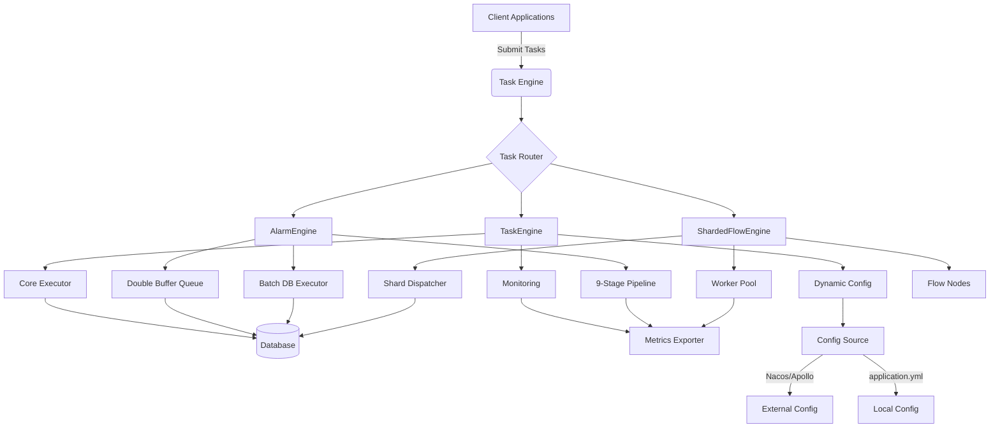
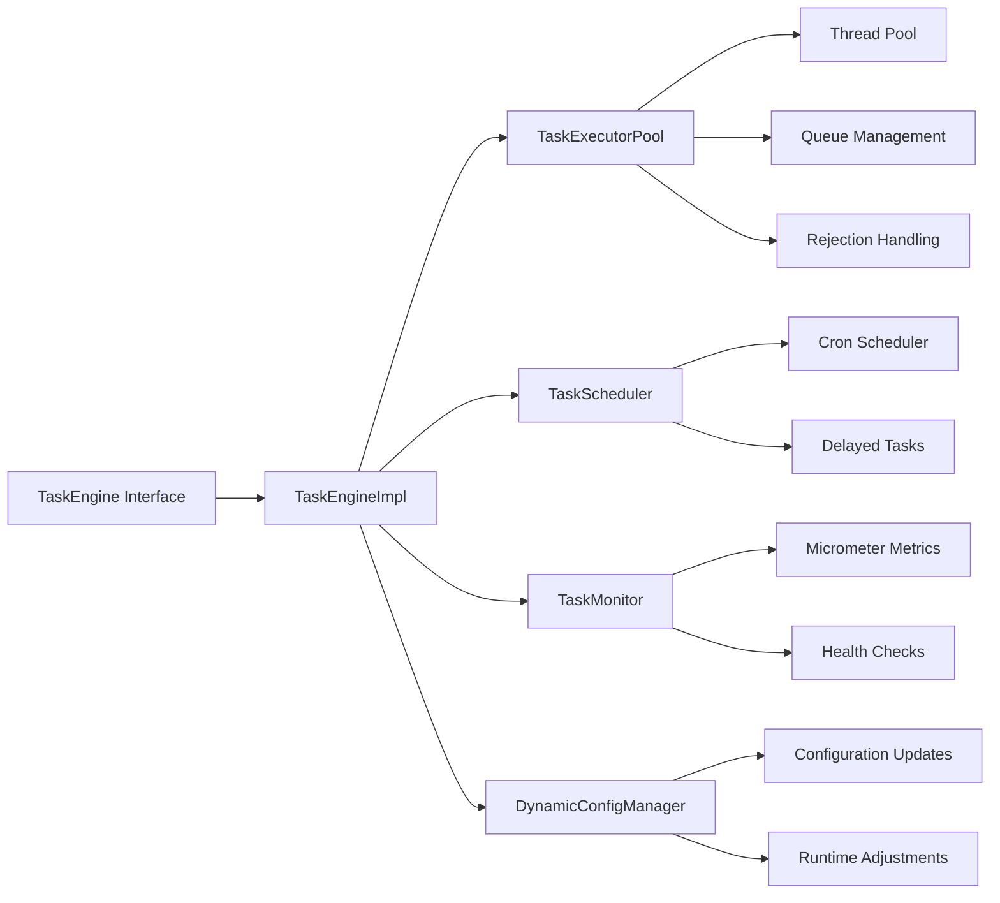
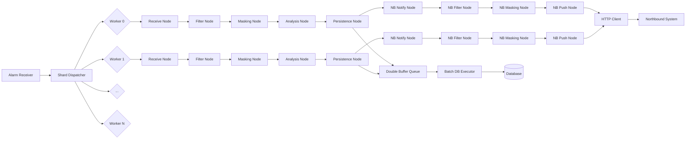
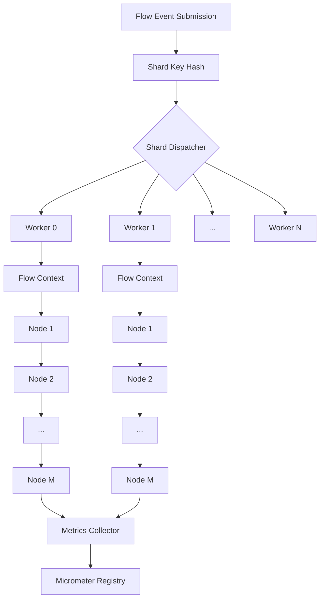

# Task Engine Architecture Diagrams

## Overall Architecture

```mermaid
graph TD
    A[Client Applications] -->|Submit Tasks| B(Task Engine)
    B --> C{Task Router}
    C --> D[TaskEngine]
    C --> E[AlarmEngine]
    C --> F[ShardedFlowEngine]
    
    D --> G[Core Executor]
    D --> H[Monitoring]
    D --> I[Dynamic Config]
    
    E --> J[9-Stage Pipeline]
    E --> K[Double Buffer Queue]
    E --> L[Batch DB Executor]
    
    F --> M[Shard Dispatcher]
    F --> N[Worker Pool]
    F --> O[Flow Nodes]
    
    G --> P[(Database)]
    K --> P
    L --> P
    M --> P
    
    H --> Q[Metrics Exporter]
    J --> Q
    N --> Q
    
    I --> R[Config Source]
    R -->|Nacos/Apollo| S[External Config]
    R -->|application.yml| T[Local Config]
```

## Task Engine Core Components

```mermaid
graph LR
    A[TaskEngine Interface] --> B[TaskEngineImpl]
    B --> C[TaskExecutorPool]
    B --> D[TaskScheduler]
    B --> E[TaskMonitor]
    B --> F[DynamicConfigManager]
    
    C --> G[Thread Pool]
    C --> H[Queue Management]
    C --> I[Rejection Handling]
    
    D --> J[Cron Scheduler]
    D --> K[Delayed Tasks]
    
    E --> L[Micrometer Metrics]
    E --> M[Health Checks]
    
    F --> N[Configuration Updates]
    F --> O[Runtime Adjustments]
```

## Alarm Engine Pipeline Flow

```mermaid
flowchart LR
    A[Alarm Receiver] --> B[Shard Dispatcher]
    B --> C{Worker 0}
    B --> D{Worker 1}
    B --> E{...}
    B --> F{Worker N}
    
    C --> G[Receive Node]
    G --> H[Filter Node]
    H --> I[Masking Node]
    I --> J[Analysis Node]
    J --> K[Persistence Node]
    K --> L[NB Notify Node]
    L --> M[NB Filter Node]
    M --> N[NB Masking Node]
    N --> O[NB Push Node]
    
    D --> G2[Receive Node]
    G2 --> H2[Filter Node]
    H2 --> I2[Masking Node]
    I2 --> J2[Analysis Node]
    J2 --> K2[Persistence Node]
    K2 --> L2[NB Notify Node]
    L2 --> M2[NB Filter Node]
    M2 --> N2[NB Masking Node]
    N2 --> O2[NB Push Node]
    
    K --> P[Double Buffer Queue]
    K2 --> P
    P --> Q[Batch DB Executor]
    Q --> R[(Database)]
    
    O --> S[HTTP Client]
    O2 --> S
    S --> T[Northbound System]
```

## Sharded Flow Engine Architecture

```mermaid
graph TD
    A[Flow Event Submission] --> B[Shard Key Hash]
    B --> C{Shard Dispatcher}
    
    C --> D[Worker 0]
    C --> E[Worker 1]
    C --> F[...]
    C --> G[Worker N]
    
    D --> H[Flow Context]
    H --> I[Node 1]
    I --> J[Node 2]
    J --> K[...]
    K --> L[Node M]
    
    E --> H2[Flow Context]
    H2 --> I2[Node 1]
    I2 --> J2[Node 2]
    J2 --> K2[...]
    K2 --> L2[Node M]
    
    L --> M[Metrics Collector]
    L2 --> M
    M --> N[Micrometer Registry]
```